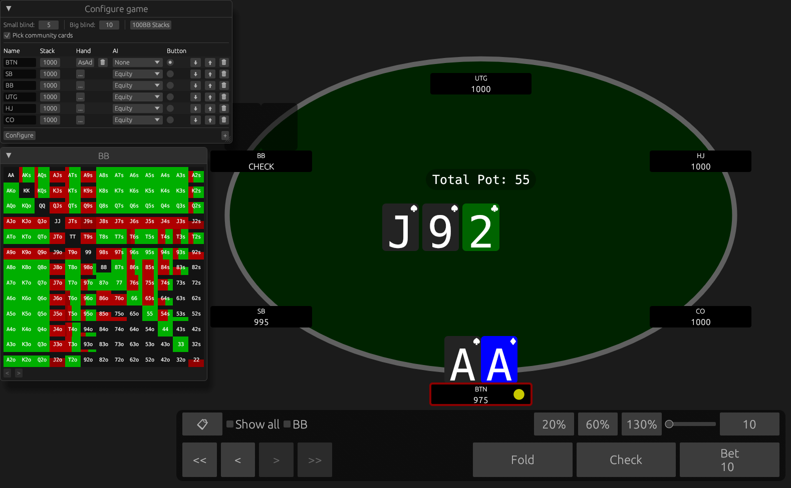

# Poker Toolkit - Equity Calculator, GUI, and Library



Calculate the equity, win- and tie-percentage of a given hand in Texas Hold'em
via the commandline.

Also includes gameplay and history GUI and library methods.

# Usage

## Equity Calculator

### Enumerate

Calculates the equity for all card combinations
with the given community cards and player ranges.
E.g.:

```
cd poker-app
cargo run --release -- enumerate AsTd3h      AhTh   AKo+,AKs+,TT+,33 full
#                                ^           ^      ^                ^
#                                community   hero   villain 1        villain 2 ...
# Output:
# player 1: equity=72.80 win=72.58 tie=0.22
# player 2: equity=21.60 win=21.47 tie=0.13
# player 3: equity=5.60 win=5.36 tie=0.23
```

The `enumerate-table` command can be used instead, which outputs
the equities for each player hand in each range.

### Simulate

Calculate the equity via Monte Carlo simulation
with the given community cards, player ranges
and number of rounds (use at least 100,000 for reasonable results).
Useful if the number of remaining community cards
and player ranges are large, where enumeration is too slow.
Not exact, but usually close enough. With more players
and larger ranges, the precision decreases.
E.g.:

```
cd poker-app
cargo run --release -- simulate  1000000 AsTd3h      AhTh   AKo+,AKs+,TT+,33 full        full
#                                ^       ^           ^      ^                ^           ^
#                                rounds  community   hero   villain 1        villain 2   villain 3 ...
# Output:
# player 1: equity=68.88 win=68.52 tie=0.36
# player 2: equity=20.42 win=20.22 tie=0.20
# player 3: equity=5.34 win=5.02 tie=0.31
# player 4: equity=5.36 win=5.05 tie=0.32
```

The `simulate-table` command can be used instead, which outputs
the equities for each player hand in each range.

## Gameplay GUI

Play against simple AI opponents and program hands.

```
cd poker-app
cargo run --release -- gui
```

## Hand Histories

### Parse hands

Parse different hand history formats and write them to a SQLite database.
Supported hand history formats include the GG Poker format,
the Poker Hand History (PHH) format, and an iPoker style XML format.
Only No Limit Texas Hold'em cash games are supported.

```
cd poker-app
cargo run --release -- parse-gg DB_PATH HAND_HISTORY_PATH
cargo run --release -- parse-phhs DB_PATH HAND_HISTORY_PATH
cargo run --release -- parse-xml DB_PATH HAND_HISTORY_PATH
```

### History Viewer GUI

View and browse hands from a database.

```
cd poker-app
cargo run --release -- history-gui DB_PATH [SQL_QUERY]
```
